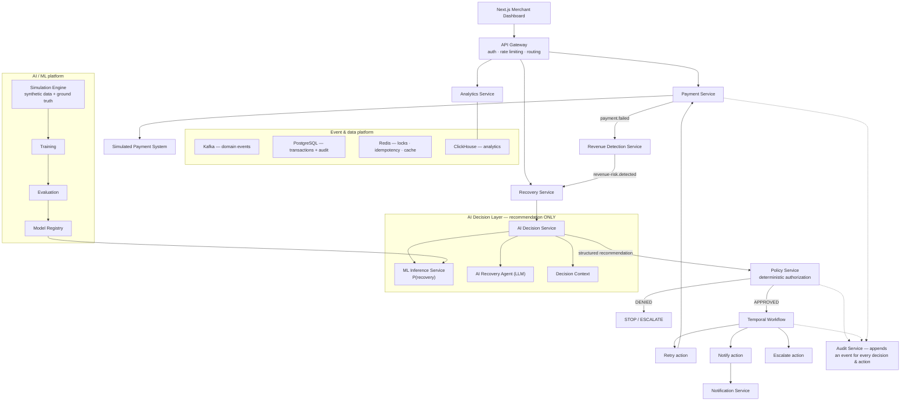
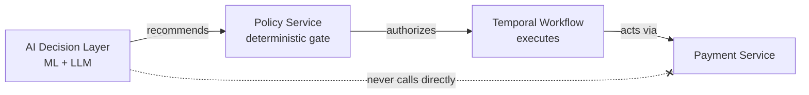

# Architecture

> **AI recommends. Policy authorizes. Workflow executes. Payment system acts. Audit records. Analytics measures. ML learns.**

This directory is the navigable overview of the platform's architecture. It
**structures and visualizes** the design; it does not replace it.
[`PROJECT_SPEC.md`](../../PROJECT_SPEC.md) remains the **canonical source of
truth**, and every page here links back to the spec section it reflects.

## Contents

| Document                                         | What it covers                                                                     | Spec source                                              |
| ------------------------------------------------ | ---------------------------------------------------------------------------------- | -------------------------------------------------------- |
| This page                                        | System context, the money-movement boundary, architecture principles               | [§5](../../PROJECT_SPEC.md), [§6](../../PROJECT_SPEC.md) |
| [service-boundaries.md](./service-boundaries.md) | The eleven services, what each owns, and the recommend → authorize → execute chain | [§8](../../PROJECT_SPEC.md)                              |
| [recovery-lifecycle.md](./recovery-lifecycle.md) | The eight-stage lifecycle and the failed-payment vertical slice                    | [§3](../../PROJECT_SPEC.md), [§4](../../PROJECT_SPEC.md) |
| [../decisions/](../decisions/)                   | Architecture Decision Records (ADRs)                                               | —                                                        |

## What the platform does

A merchant payment fails. The platform opens a recovery case, quantifies the
revenue at risk, predicts whether it is recoverable, has an AI agent recommend
an intervention, validates that recommendation against deterministic financial
policy, executes the approved action through a durable workflow, and measures
the money actually recovered — recording an audit event at every consequential
step.

## System context

The high-level component view derived from [`PROJECT_SPEC.md` §6](../../PROJECT_SPEC.md).
The critical property is that **intelligence and money movement are separated**:
the ML model and LLM agent only _produce a recommendation_; a deterministic
policy gate authorizes it; a durable workflow executes it; only the payment
service acts.

> The dashed lines to the Audit Service indicate that decisions and actions
> across the system emit audit events; they are not a single call path.

## Architecture principles

These five principles (from [`PROJECT_SPEC.md` §5](../../PROJECT_SPEC.md)) are
load-bearing. Everything else is downstream of them.

1. **AI and financial execution are separated.** `LLM → Payment API` is never
   allowed. The only path is `LLM → structured recommendation → Policy Engine →
(approved?) → Workflow → Payment System`.
2. **Deterministic controls override AI.** The agent may _recommend_, but it can
   never override retry limits, retry intervals, contact limits, amount limits,
   business rules, stop conditions, or escalation requirements.
3. **Every financial action is auditable.** Every consequential decision and
   action produces an audit event.
4. **Workflows survive failures.** Recovery is long-running and must tolerate
   delays, retries, timeouts, worker crashes, external failures, duplicate
   events, and unknown payment states — continuing or terminating safely.
5. **Metrics come from real evaluation.** Revenue recovered, recovery rate,
   precision, recall, ROI, and "AI improvement" are never fabricated; all are
   reproducible from synthetic data and recorded evaluation runs.

## The money-movement boundary

This is the single most important invariant in the system, so it is worth
stating on its own:

Intelligence flows left-to-right only through the deterministic gate. The
crossed, dashed edge — an AI component calling the payment service directly — is
the one path the architecture must make impossible.
