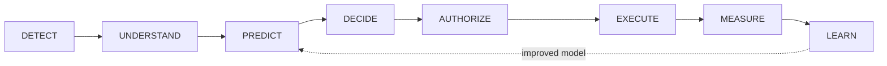
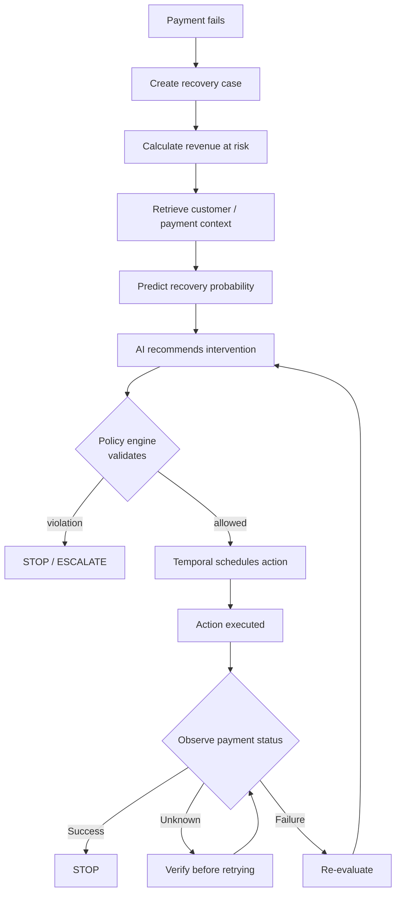
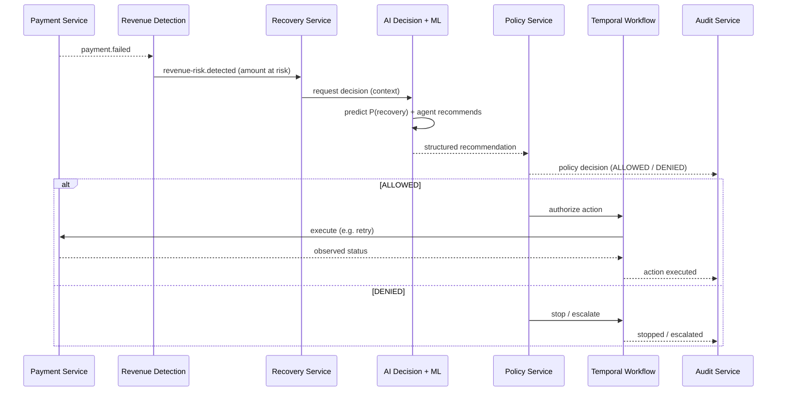

# Recovery Lifecycle

Every recovery case follows one conceptual lifecycle
([`PROJECT_SPEC.md` §3](../../PROJECT_SPEC.md)). This page maps that lifecycle
onto the concrete **failed-payment** vertical slice ([§4](../../PROJECT_SPEC.md))
and the [services](./service-boundaries.md) that own each stage.

See also: [architecture overview](./README.md) · [service boundaries](./service-boundaries.md).

## The eight stages

The loop is deliberate: outcomes measured and learned from feed back into future
predictions. Note the ordering — **DECIDE precedes AUTHORIZE**. Intelligence
produces a recommendation first; the deterministic policy gate authorizes it
second. That ordering is the lifecycle expression of the money-movement boundary.

| Stage          | Question it answers                      | Owning service                           | Representative event                                             |
| -------------- | ---------------------------------------- | ---------------------------------------- | ---------------------------------------------------------------- |
| **DETECT**     | Is revenue at risk, and how much?        | Revenue Detection                        | `payment.failed` → `revenue-risk.detected`                       |
| **UNDERSTAND** | What is the customer/payment context?    | Recovery + AI Decision                   | `recovery.created`                                               |
| **PREDICT**    | How likely is recovery?                  | ML Inference                             | —                                                                |
| **DECIDE**     | Which intervention should we recommend?  | AI Decision (agent)                      | `recovery.decision.created`                                      |
| **AUTHORIZE**  | Is that action allowed by policy?        | Policy                                   | —                                                                |
| **EXECUTE**    | Carry out the approved action            | Temporal workflow + Payment/Notification | `recovery.action.requested` → `recovery.action.executed`         |
| **MEASURE**    | What actually happened?                  | Analytics (+ Payment status)             | `recovery.completed` / `recovery.stopped` / `recovery.escalated` |
| **LEARN**      | Improve predictions against ground truth | Simulation + ML training/eval            | —                                                                |

Event names are from [`PROJECT_SPEC.md` §12](../../PROJECT_SPEC.md); dashes mark
stages that are internal steps rather than published domain events.

## The failed-payment vertical slice

The first complete slice ([§4](../../PROJECT_SPEC.md)). A payment fails and the
platform drives it to a safe terminal state — never acting on an unknown result.

The branch logic mirrors [`PROJECT_SPEC.md` §11](../../PROJECT_SPEC.md):

- **Success → STOP.** The case is resolved; stop acting.
- **Failure → Re-evaluate.** Loop back through decision + policy (which may then
  retry, notify, escalate, or stop — always within policy limits).
- **Unknown → Verify.** Never retry blindly on an unknown payment state; confirm
  the true state first, then decide.
- **Policy violation → STOP / ESCALATE.** Deterministic controls end or escalate
  the case regardless of what the AI recommended.

## As an interaction

The same slice viewed as the sequence across services, showing where the
recommendation is produced versus authorized versus executed:

> Audit events are emitted throughout (principle
> [§5.3](../../PROJECT_SPEC.md)); only a representative subset is shown.

## Reliability at the boundaries

The lifecycle assumes the reliability guarantees in
[`PROJECT_SPEC.md` §13](../../PROJECT_SPEC.md): idempotent handling of duplicate
events, retries with exponential backoff, distributed locks, and — most
importantly for **EXECUTE → MEASURE** — never treating an _unknown_ payment
state as either success or failure.
