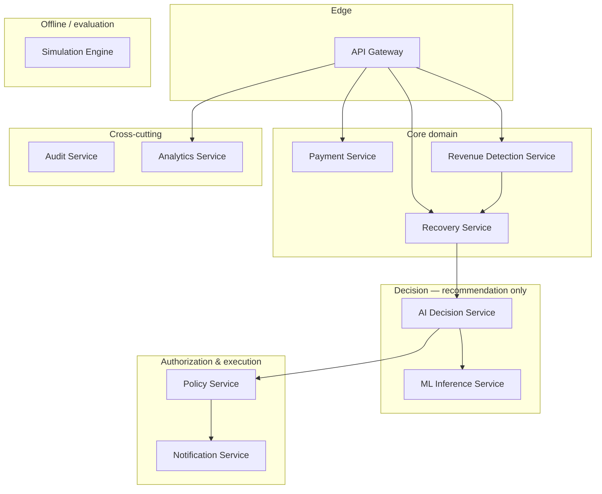

# Service Boundaries

Faithful to [`PROJECT_SPEC.md` §8](../../PROJECT_SPEC.md). Each service owns a
single area of responsibility. The boundaries exist to keep the
**recommend → authorize → execute** separation intact: no single service both
_decides_ with AI and _moves money_.

See also: [architecture overview](./README.md) · [recovery lifecycle](./recovery-lifecycle.md).

## Services at a glance

## The recommend → authorize → execute chain

The chain from [`PROJECT_SPEC.md` §5.1](../../PROJECT_SPEC.md) determines which
service is allowed to do what:

- **AI Decision Service + ML Inference Service** _recommend_. They gather
  context, predict `P(recovery)`, and emit a structured recommendation. They
  **never** execute financial actions.
- **Policy Service** _authorizes_. It applies deterministic rules and returns
  `ALLOWED` or `DENIED`. It cannot be overridden by the AI.
- **Temporal workflow** (see [workflow architecture, §11](../../PROJECT_SPEC.md))
  _executes_ only what policy approved.
- **Payment Service** _acts_. It is the only service that transitions real
  payment state.

## The eleven services

### API Gateway

Authentication, authorization, request validation, rate limiting, routing, and
API aggregation where appropriate. **Must not contain core business logic.**

### Payment Service

Payments, payment attempts, payment status, gateway webhook handling,
idempotency, and payment state transitions. This is the **only** service that
moves payment state, and it is the terminal actor in the execution chain.

### Revenue Detection Service

Identifies failed or recoverable revenue, calculates revenue at risk, detects
relevant revenue-risk events, and creates revenue-risk records. It answers _"how
much is at stake?"_ — it does not decide what to do about it.

### Recovery Service

Owns recovery cases, recovery state, the recovery lifecycle, and recovery
history. It is the orchestrator of a case's progression, delegating the
_decision_ to the AI Decision Service and the _authorization_ to Policy.

### AI Decision Service

Gathers decision context, calls the ML prediction service, invokes the AI
agent, and produces a **structured recommendation**. Explicit boundary from the
spec: it **never directly executes financial actions**.

### ML Inference Service

Feature processing, recovery-probability prediction, model versioning, and
prediction metadata. It returns a probability and model version (e.g.
`{"recovery_probability": 0.87, "model_version": "recovery-v1"}`) — nothing more.

### Policy Service

Deterministic financial rules and action authorization: retry limits, contact
limits, stop conditions, and escalation conditions. Policy evaluation **must be
deterministic** and overrides any AI recommendation. (Example rules:
`MAX_RETRIES`, `MIN_RETRY_INTERVAL`, `MAX_CUSTOMER_NOTIFICATIONS` — see
[§10](../../PROJECT_SPEC.md).)

### Notification Service

Simulated email/SMS/notification delivery, templates, delivery status, and rate
limits. Delivery is **simulated** in this platform, not wired to a real provider.

### Audit Service

Appends audit events and preserves decision history, action history, policy
decisions, and workflow history. It is append-only and receives events from
across the system (principle §5.3: every consequential action is auditable).

### Analytics Service

Revenue metrics, recovery metrics, AI performance, funnel analytics, and
operational metrics. It _measures_; its figures must trace back to real
evaluation runs (principle §5.5), never fabricated.

### Simulation Engine

Synthetic customer, payment, and failure generation; customer-behavior and
recovery-outcome simulation; and **ground-truth generation**. It produces the
data the ML model trains and is evaluated against, and it stands in for the real
world during development.

## Ownership summary

| Service           | Owns / decides                           | Explicitly does **not**     |
| ----------------- | ---------------------------------------- | --------------------------- |
| API Gateway       | Edge concerns (authn/z, routing, limits) | Business logic              |
| Payment           | Payment state + transitions              | Recovery decisions          |
| Revenue Detection | Revenue-at-risk detection                | Choosing interventions      |
| Recovery          | Case lifecycle + history                 | Predicting / authorizing    |
| AI Decision       | Structured recommendation                | Executing financial actions |
| ML Inference      | `P(recovery)` + model version            | Selecting the action        |
| Policy            | Deterministic authorization              | Being overridden by AI      |
| Notification      | Simulated delivery                       | Real provider integration   |
| Audit             | Append-only event history                | Mutating records            |
| Analytics         | Metrics from evaluation                  | Fabricating metrics         |
| Simulation        | Synthetic data + ground truth            | Live/production data        |
